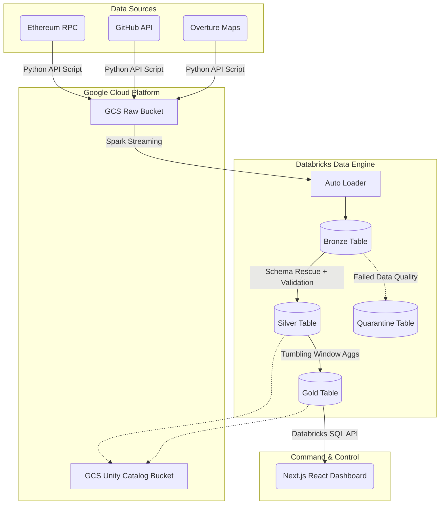

# Enterprise Databricks Lakehouse & Real-Time Data Intelligence Platform

[](https://opensource.org/licenses/MIT)
[](https://databricks.com/)
[](https://cloud.google.com/)
[](https://nextjs.org/)

An **industrial-scale, production-grade data intelligence platform** built on Databricks and GCP (Project: `databrick-project-510903`). This platform demonstrates enterprise data engineering best practices processing **3 Global Datasets (Ethereum Web3, GitHub Archive, Overture Maps)** totaling over 17 Billion records historically, with real-time continuous ingestion streaming via Databricks Auto Loader. 

All computational workloads are strictly isolated to **GCP compute resources** and orchestrated remotely, ensuring absolutely **zero local computation**. 

This system features a strict Medallion architecture, Unity Catalog governance, PySpark real-time streaming, automated data quality quarantines, and full operational observability via a custom Next.js Premium Command Center.

---

## 🏗️ Architecture Overview

The system is designed with a complete decoupled compute/storage paradigm, utilizing Google Cloud Storage for the Data Lake and Databricks as the massive parallel processing (MPP) compute engine.



---

## 🛠️ Technology Stack

| Domain | Technology / Framework | Justification & Usage |
|----------|-----------|-----------|
| **Cloud Provider** | Google Cloud Platform (GCP) | Foundational infrastructure, IAM, and object storage for the Data Lake. |
| **Lakehouse Compute** | Databricks | Unified analytics platform processing both batch and streaming PySpark workloads. |
| **Data Processing** | Apache Spark / PySpark | Distributed in-memory data processing across GCP worker nodes. |
| **Storage Format** | Delta Lake (Parquet + Transaction Log) | ACID transactions, time travel, and high-performance querying on cloud object storage. |
| **Data Governance** | Unity Catalog | Centralized access control, data lineage, and schema enforcement. |
| **Streaming Ingestion** | Databricks Auto Loader (`cloudFiles`) | Highly scalable, low-latency ingestion of raw JSON files from GCS buckets. |
| **Telemetry & UI** | Next.js 14, React, Framer Motion | A high-performance, edge-rendered dashboard querying Databricks SQL Serverless via `@databricks/sql`. |

---

## 📊 The 3 Global Datasets

This platform is specifically tuned to ingest and transform three massive, disparate real-time datasets. Each dataset introduces unique engineering challenges that are solved in the Medallion pipeline.

### 1. 🦇 Ethereum Web3
The Ethereum blockchain represents an append-only ledger of state changes. 
*   **Ingestion:** Auto Loader with `schemaEvolutionMode: "rescue"` to safely handle unexpected smart contract events or malformed transaction objects.
*   **Transformations:** Complex Hex-to-Long decoding of `gas` and transaction `value` using PySpark UDFs during Silver processing.
*   **Gold Metrics:** Daily ETH transferred, average gas utilized, and wallet activity trends mapped over tumbling time windows.

### 2. 🐙 GitHub Archive
GitHub Archive provides a near real-time firehose of developer events worldwide.
*   **Ingestion:** Auto Loader with `schemaEvolutionMode: "addNewColumns"` for highly nested, evolving JSON events that frequently introduce new fields.
*   **Transformations:** Unpacking deeply nested structs (`repo.name`, `actor.login`) and enforcing strict row deduplication.
*   **Gold Metrics:** Daily repository event velocity, global developer activity, and technology trend analysis.

### 3. 🗺️ Overture Maps
Overture Maps provides highly precise, massive geospatial data representing physical places on Earth.
*   **Ingestion:** High-throughput geospatial Parquet ingestion via Databricks Auto Loader.
*   **Transformations:** Strict geospatial boundary validations. Latitudes must fall between -90 and 90, and Longitudes between -180 and 180.
*   **Gold Metrics:** Point of Interest (POI) categorization, density heatmaps, and global region mapping.

---

## 🛡️ Enterprise Data Quality & Quarantine

Data engineering is fundamentally about trust. If data is flawed, downstream analytics are meaningless. This pipeline enforces a strict "fail-forward" data quality paradigm.

*   **Rule Engine:** Enforces `is_not_null`, Regex pattern matching, and logical boundary checks at the boundary between Bronze and Silver.
*   **Quarantine Flow (Dead Letter Queue):** Records failing fatal constraints (e.g., an Ethereum transaction missing a hash, or an Overture Map coordinate exceeding 90 degrees latitude) are automatically stripped from the primary pipeline and routed to a dedicated `quality.quarantine` Delta table.
*   **Transparency:** The Next.js Command Center explicitly queries the Quarantine table and surfaces real-time alerting for data quality breaches, enabling engineers to inspect the exact `_quarantine_failed_rules` metadata appended by Spark.

---

## 🚀 Getting Started

### Prerequisites
- Python 3.10+
- Node.js 20+
- Google Cloud Platform Account
- Databricks Workspace (Enterprise or 14-Day Free Trial)

### 1. Clone & Configure
```bash
git clone https://github.com/iamdpsingh/Enterprise-Databricks-Lakehouse-Real-Time-Data-Intelligence-Platform.git
cd Enterprise-Databricks-Lakehouse-Real-Time-Data-Intelligence-Platform

# Set up Python Environment
python3 -m venv .venv
source .venv/bin/activate
pip install -r requirements.txt
```

### 2. Configure Environment Variables
Create a `.env` file at the root of the project:
```env
DATABRICKS_HOST="https://your-workspace.cloud.databricks.com/"
DATABRICKS_TOKEN="dapi-your-secret-token"

# GCP Credentials
GOOGLE_CLOUD_PROJECT="databrick-project-510903"
GOOGLE_APPLICATION_CREDENTIALS="/absolute/path/to/your/gcp-service-account-key.json"

# UI Credentials
NEXT_PUBLIC_DATABRICKS_SQL_HTTP_PATH="/sql/1.0/warehouses/your-warehouse-id"
NEXT_PUBLIC_DATABRICKS_API_TOKEN="dapi-your-secret-token"
```

### 3. Execute the True Pipeline Architecture
Instead of using mock data, this project runs an authentic GCP-to-Databricks pipeline.

**Terminal 1: Start GCP Ingestion**
This script hits APIs and drops physical JSON files into your Google Cloud Storage bucket.
```bash
python3 gcp_api_to_gcs.py
```

**Terminal 2: Start the Next.js Command Center**
This UI polls the Databricks SQL endpoint to track the pipeline in real-time.
```bash
cd monitoring-ui
npm install
npm run dev
```

**Databricks Workspace: Start Auto Loader**
Inside Databricks, run the PySpark Auto Loader script (`src/pipelines/ethereum/bronze_ingestion.py`) to stream the GCP JSON files directly into the Delta tables. The UI will instantly reflect the throughput!

---

## 📖 Documentation Directory

Explore the deep technical decision-making and architecture specs in the `docs/` folder:

- [Data Architecture](./docs/architecture/data-architecture.md)
- [ADR 001: Lakehouse Architecture Baseline](./docs/decisions/001-lakehouse-architecture-baseline.md)
- [ADR 002: Data Quality & Quarantine](./docs/decisions/002-data-quality-and-quarantine.md)
- [ADR 003: Orchestration Strategy](./docs/decisions/ADR-003-orchestration-strategy.md)

---
*Built for industrial scale. Operating entirely on the Cloud.*
