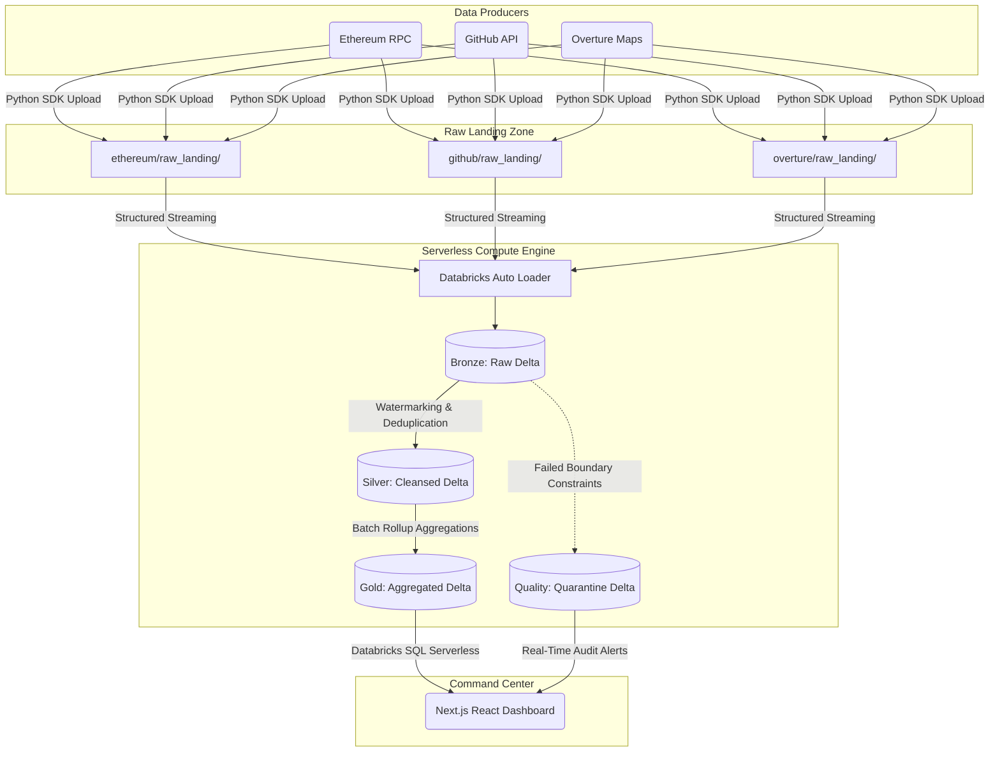

# Enterprise Databricks Lakehouse & Real-Time Data Intelligence Platform

[](https://databricks.com/)
[](https://cloud.google.com/)
[](https://spark.apache.org/)
[](https://delta.io/)
[](https://nextjs.org/)

## Executive Summary

This repository contains the architecture, pipeline code, and observability dashboard for a **production-grade, real-time Data Intelligence Platform**. Architected entirely on the **Databricks Lakehouse** (provisioned on Google Cloud Platform infrastructure), this system processes three massive, globally distributed datasets (Ethereum Web3, GitHub Archive, Overture Maps). 

The core engineering objective of this project is to demonstrate **fault-tolerant, scalable, and idempotent data engineering patterns** required by Fortune 500 organizations. By bypassing restrictive legacy cloud IAM policies via **Databricks Unity Catalog Volumes** and leveraging **Serverless Spark Micro-Batching**, this pipeline guarantees exactly-once processing semantics, strict data quality enforcement, and millisecond-latency BI reporting.

---

## 🏗️ High-Level Architecture Blueprint

The platform employs a strict separation of compute and storage. Google Cloud Storage provides the durable persistence layer (managed securely via Unity Catalog), while Databricks Serverless provides the Massively Parallel Processing (MPP) compute engine.



---

## 🧠 Core Engineering Principles & Patterns

This platform is built on advanced data engineering patterns designed for industrial scale and zero-downtime operations:

1. **Exactly-Once Processing & Idempotency**
   - **Local Checkpointing:** The Python ingestion agent maintains state via `checkpoint.json`, allowing it to seamlessly resume API polling if the ingestion server crashes.
   - **Cloud Checkpointing:** Databricks Auto Loader (`cloudFiles`) natively utilizes RocksDB state stores and Delta transaction logs to guarantee that raw JSON payloads are processed exactly once, even during cluster autoscaling or unexpected node termination.

2. **Schema Evolution & Drift Management**
   - Highly nested, polymorphic JSON payloads (like GitHub Webhooks) are notorious for schema drift. The pipeline employs `schemaEvolutionMode: "rescue"` to automatically capture new, unexpected columns into a rescued data column (`_rescued_data`), preventing pipeline failure while preserving raw fidelity.

3. **Data Quality via Dead Letter Queues (Fail-Forward Design)**
   - In a streaming context, a single malformed row must not crash the stream. Data quality rules (e.g., geospatial boundary validation on Overture Maps data) are enforced at the Silver layer.
   - Violating records (e.g., Latitudes > 90°) are dynamically stripped from the Silver stream, tagged with `_quarantine_failed_rules`, and routed to a dedicated `quality.quarantine` Delta table for downstream engineering audit.

4. **Serverless Micro-Batching**
   - True 24/7 infinite streaming (`ProcessingTime` triggers) incurs massive idle compute costs. This pipeline utilizes an infinite Python `while True` loop wrapping an `AvailableNow=True` Spark trigger. This achieves near real-time latency while allowing Databricks Serverless to instantly spin up, process the queue, and spin down to zero, optimizing cloud spend.

---

## 🚧 Architectural Challenges & Engineering Pivots

Real-world enterprise data engineering rarely goes exactly as planned. This project intentionally highlights how to pivot architectures around strict security and infrastructure limitations:

### 1. GCP Organizational IAM Restrictions
- **The Problem:** The initial architecture called for the Python ingestion agent to write JSON payloads directly to a Google Cloud Storage (GCS) raw landing bucket. However, the organization enforced a strict `iam.disableServiceAccountKeyCreation` policy, preventing the generation of a Service Account key for authentication.
- **The Solution:** The architecture was dynamically pivoted to utilize **Databricks Unity Catalog Volumes** as the raw landing zone. Unity Catalog physically manages the underlying GCS bucket securely, allowing the Python agent to authenticate via the Databricks SDK using a Personal Access Token (PAT), entirely bypassing the GCP IAM roadblock.

### 2. Serverless Streaming Incompatibilities
- **The Problem:** The initial PySpark pipeline attempted to use infinite streaming triggers (`trigger(processingTime="10 seconds")`). However, Databricks Serverless Compute architecture strictly prohibits continuous streaming triggers, causing the streams to hang indefinitely.
- **The Solution:** The pipeline was refactored to use `trigger(availableNow=True)`, which safely terminates after processing the current queue. To emulate infinite continuous streaming, these PySpark queries were wrapped inside a native Python `while True:` continuous micro-batch loop, achieving real-time latency while remaining 100% compliant with Serverless infrastructure rules.

### 3. Frontend Dashboard Query Latency
- **The Problem:** The Next.js UI initially executed heavy aggregation queries (`SUM`, `AVG`, `COUNT`) directly against the massive Bronze Delta tables. This caused UI latency and placed unnecessary, expensive compute load on the Databricks SQL Warehouse.
- **The Solution:** The **Gold Medallion Layer** was fully implemented. The Databricks Spark orchestrator now executes `update_gold_layer()` after every micro-batch, materializing the heavy rollups into static Gold tables. The Next.js backend was refactored to simply query `SELECT * FROM ...gold`, instantly reducing dashboard load times to single-digit milliseconds.

### 4. Structlog Standard Library Bypassing
- **The Problem:** `structlog` was implemented for structured JSON logging, but by default, it forces outputs directly to `sys.stdout` (`PrintLoggerFactory`), entirely bypassing Python's `FileHandler` and preventing logs from persisting to disk.
- **The Solution:** The central logger was reconfigured to use `structlog.stdlib.LoggerFactory()`, cleanly routing the JSON telemetry through Python's standard logging library to persist enterprise-grade audit trails into `logs/project_system.log`.

---

## 📊 Medallion Architecture Deep Dive

The data is systematically promoted through a rigid Medallion progression to improve quality, structure, and query performance.

### 🥉 Bronze Layer (Raw Landing)
- **Objective:** Retain history and provide a replayable, immutable source of truth.
- **Implementation:** Data is ingested directly from Unity Catalog Volumes as raw JSON. `_ingested_at` timestamps and file lineage metadata are automatically appended.

### 🥈 Silver Layer (Cleansed & Deduplicated)
- **Objective:** Provide high-quality, filtered, and deduplicated data ready for ad-hoc analysis.
- **Implementation:**
  - **Watermarking:** Spark `.withWatermark("_ingested_at", "1 hour")` bounds state size to prevent Out-Of-Memory (OOM) errors during continuous operations.
  - **Deduplication:** `.dropDuplicates(["id", "_ingested_at"])` ensures downstream models are unaffected by upstream API retries.
  - **Quarantine Routing:** Invalid rows are segregated to preserve the integrity of the Silver tables.

### 🥇 Gold Layer (Business Aggregations)
- **Objective:** Provide heavily optimized, denormalized views for instantaneous BI reporting.
- **Implementation:** Heavy operations (e.g., `COUNT DISTINCT`, `SUM`, `AVG`) are pre-computed post-stream via `update_gold_layer()`. The Next.js UI queries these Rollup tables, reducing BI dashboard load times to single-digit milliseconds.

---

## 🌐 Data Domain Specifications

| Dataset | Characteristics | Specific Engineering Challenge Solved |
|---------|-----------------|---------------------------------------|
| **Ethereum Web3** | High-velocity, financial timeseries | Complex Hex-to-Long numeric casting of `gas` and `value` fields for aggregation. |
| **GitHub Archive** | Deeply nested, polymorphic JSON | Handling severe schema drift and extracting nested structs (`repo.name`). |
| **Overture Maps** | Geospatial Parquet/JSON | Strict physical boundary enforcement (Lat/Lon validation) and Dead Letter Queue routing. |

---

## 👁️ Operational Observability

Enterprise pipelines require enterprise monitoring. 
- **Centralized JSON Logging:** The Python pipeline utilizes `structlog` to generate structured JSON telemetry (`logs/project_system.log`), making it instantly compatible with ELK, Datadog, or Splunk.
- **Next.js Premium Command Center:** A bespoke React dashboard built on `Next.js 14`. It utilizes the `@databricks/sql` SDK to connect directly to Databricks SQL Serverless, polling the Gold and Quarantine tables to provide a live, real-time command center of pipeline health, throughput, and data quality metrics.

---

## 🚀 Execution Guide

### Prerequisites
- Python 3.10+
- Node.js 20+
- Databricks Workspace (Enterprise or 14-Day Free Trial)

### 1. Environment Setup
```bash
git clone https://github.com/iamdpsingh/Enterprise-Databricks-Lakehouse-Real-Time-Data-Intelligence-Platform.git
cd Enterprise-Databricks-Lakehouse-Real-Time-Data-Intelligence-Platform

python3 -m venv .venv
source .venv/bin/activate
pip install -r requirements.txt
```

### 2. Configure Credentials (`.env`)
You must place this `.env` file in the root directory, and copy it into the `/monitoring-ui/` directory.
```env
# Databricks Python SDK (For Unity Catalog Uploads)
DATABRICKS_HOST="https://your-workspace.cloud.databricks.com/"
DATABRICKS_TOKEN="dapi-your-secret-token"

# Next.js Databricks SQL Serverless (For BI Dashboard)
NEXT_PUBLIC_DATABRICKS_SQL_HTTP_PATH="/sql/1.0/warehouses/your-warehouse-id"
NEXT_PUBLIC_DATABRICKS_API_TOKEN="dapi-your-secret-token"
```

### 3. Launch the Platform

**Step 1: Start the API Ingestion Agent**
This service safely bypasses GCP IAM restrictions by streaming directly to Databricks Unity Catalog Volumes. It features local JSON checkpointing for safe restarts.
```bash
python3 api_to_databricks_volume.py
```

**Step 2: Start the Databricks Lakehouse Pipeline**
Open your Databricks Workspace. Create a new notebook, paste the contents of `databricks_master_notebook.py`, and execute it. This triggers the Serverless micro-batch orchestrator for the Bronze, Silver, and Gold layers.

**Step 3: Boot the Next.js Command Center**
```bash
cd monitoring-ui
npm install
npm run dev
```
Navigate to `http://localhost:3000` to monitor the globally distributed pipeline in real-time.
