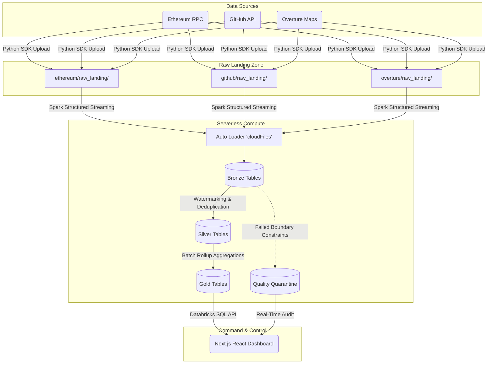

# Enterprise Databricks Lakehouse & Real-Time Data Intelligence Platform

[](https://opensource.org/licenses/MIT)
[](https://databricks.com/)
[](https://cloud.google.com/)
[](https://nextjs.org/)

An **industrial-scale, production-grade data intelligence platform** engineered on Databricks (provisioned on GCP). This architecture demonstrates enterprise data engineering best practices processing **3 Global Datasets (Ethereum Web3, GitHub Archive, Overture Maps)**. It showcases real-time continuous micro-batch ingestion streaming via Databricks Auto Loader, bypassing strict cloud IAM policies by utilizing **Unity Catalog Volumes** as the raw landing zone.

All computational workloads (Bronze, Silver, and Gold Medallion processing) are strictly isolated to **Databricks Serverless compute resources**, ensuring zero local computation. 

This system features a strict Medallion architecture, PySpark Structured Streaming, fault-tolerant local and cloud checkpointing, automated data quality quarantines (Dead Letter Queues), centralized structured JSON logging, and full operational observability via a custom Next.js Premium Command Center.

---

## 🏗️ Architecture Overview

The system is designed with a complete decoupled compute/storage paradigm, utilizing Databricks Unity Catalog Volumes (physically backed by GCP Cloud Storage) for the Data Lake, and Databricks Serverless as the massive parallel processing (MPP) compute engine.



---

## 🛠️ Technology Stack

| Domain | Technology / Framework | Justification & Usage |
|----------|-----------|-----------|
| **Underlying Infrastructure** | Google Cloud Platform (GCP) | Foundational infrastructure, networking, and object storage for Databricks. |
| **Lakehouse Compute** | Databricks Serverless | Unified analytics platform processing continuous PySpark workloads. |
| **Data Processing** | Apache Spark / PySpark | Distributed in-memory data processing, implementing `AvailableNow=True` micro-batching. |
| **Storage Format** | Delta Lake | ACID transactions, checkpointing, and high-performance querying on object storage. |
| **Data Governance** | Unity Catalog Volumes | Secure, token-based raw landing zone to bypass restrictive organizational GCP IAM policies. |
| **Streaming Ingestion** | Databricks Auto Loader | Highly scalable, stateful ingestion of raw JSON files with automated schema rescue. |
| **Telemetry & UI** | Next.js 14, React, @databricks/sql | A high-performance dashboard querying Databricks Gold and Quarantine tables in real-time. |
| **Observability** | structlog (JSON) | Centralized, enterprise-grade structured JSON logging with local file handlers. |

---

## 📊 Medallion Pipeline Engineering

This platform is specifically tuned to ingest and transform massive, disparate real-time datasets through a strict Medallion progression.

### 1. 🥉 Bronze Layer: Raw Landing & Auto Loader
Raw JSON payloads are streamed continuously into Unity Catalog Volumes via `api_to_databricks_volume.py` (which includes local file checkpointing for fault-tolerant restarts). The Databricks Master Notebook uses **Auto Loader (`cloudFiles`)** to incrementally ingest these files into Delta Bronze tables.
*   **Schema Evolution:** Employs `schemaEvolutionMode: "rescue"` to safely handle unexpected schema drifts.
*   **State Management:** Cloud-native `_checkpoints/write` directories guarantee exactly-once processing even across cluster restarts.

### 2. 🥈 Silver Layer: Deduplication & Data Quality
Data engineering is fundamentally about trust. This pipeline enforces a strict "fail-forward" data quality paradigm.
*   **Deduplication:** Utilizes Spark Watermarking (`.withWatermark()`) and `.dropDuplicates()` to ensure idempotency.
*   **Quarantine Flow (Dead Letter Queue):** Records failing fatal constraints (e.g., Overture Map coordinates exceeding 90 degrees latitude) are automatically stripped from the primary pipeline and routed to a dedicated `quality.quarantine` Delta table.

### 3. 🥇 Gold Layer: Business Aggregations
Instead of running heavy computational queries on raw tables, the Gold layer executes `update_gold_layer()` to materialize heavily optimized aggregation rollups.
*   **Efficiency:** The Next.js Command Center queries `.gold` tables directly for instant metric retrieval, minimizing compute overhead.

---

## 🚀 Getting Started

### Prerequisites
- Python 3.10+
- Node.js 20+
- Databricks Workspace (Hosted on GCP/AWS/Azure)

### 1. Clone & Configure
```bash
git clone https://github.com/iamdpsingh/Enterprise-Databricks-Lakehouse-Real-Time-Data-Intelligence-Platform.git
cd Enterprise-Databricks-Lakehouse-Real-Time-Data-Intelligence-Platform

# Set up Python Environment
python3 -m venv .venv
source .venv/bin/activate
pip install -r requirements.txt
```

### 2. Configure Environment Variables
Create a `.env` file at the root of the project:
```env
# Databricks Python SDK Credentials (for Unity Catalog Uploads)
DATABRICKS_HOST="https://your-workspace.cloud.databricks.com/"
DATABRICKS_TOKEN="dapi-your-secret-token"

# Next.js UI Credentials (for SQL Warehouse Queries)
NEXT_PUBLIC_DATABRICKS_SQL_HTTP_PATH="/sql/1.0/warehouses/your-warehouse-id"
NEXT_PUBLIC_DATABRICKS_API_TOKEN="dapi-your-secret-token"
```
*(Copy this `.env` file into the `monitoring-ui` directory as well so the frontend can access the Next.js public variables).*

### 3. Execute the Pipeline

**Terminal 1: Start Volume Ingestion (with Checkpointing & JSON Logging)**
This script safely pushes JSON files into Unity Catalog Volumes, bypassing GCP IAM blocks.
```bash
python3 api_to_databricks_volume.py
```
*(Check `logs/project_system.log` for structured enterprise telemetry).*

**Databricks Workspace: Start the Master Notebook**
Copy the contents of `databricks_master_notebook.py` into a new Databricks Notebook cell and hit Run. It will trigger an infinite `while True` loop utilizing `AvailableNow=True` for Serverless-compatible continuous micro-batching across the Bronze, Silver, and Gold layers.

**Terminal 2: Start the Next.js Command Center**
This UI polls the Databricks Gold and Quarantine tables to track the pipeline health in real-time.
```bash
cd monitoring-ui
npm install
npm run dev
```

---
*Architected for industrial scale. Operating securely on the Databricks Lakehouse Platform.*
