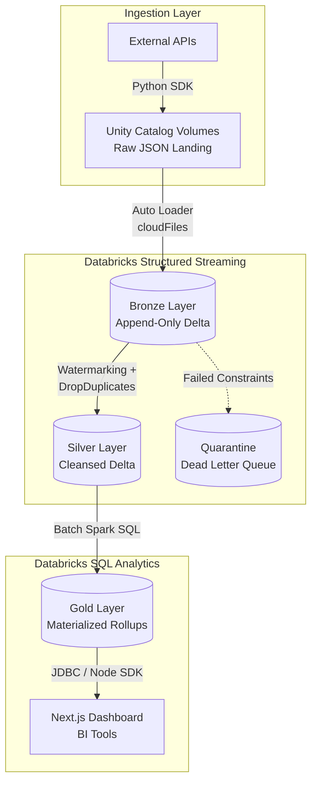

# System Architecture: The Databricks Real-Time Lakehouse

This document serves as the definitive technical blueprint for the data architecture of the Enterprise Real-Time Data Intelligence Platform. It details the precise mechanisms used to achieve exactly-once processing, real-time ingestion, and zero-downtime schema evolution across the Databricks Lakehouse.

## 1. Architectural Philosophy: The Decoupled Lakehouse

Traditional Data Warehouses (like Snowflake or Redshift) tightly couple compute and storage. While excellent for BI queries, they struggle to natively ingest massive, unstructured, or highly polymorphic streaming JSON (e.g., GitHub Webhooks) without expensive pre-processing.

Traditional Data Lakes (raw GCS/S3 buckets + Hive metastores) solve the unstructured ingestion problem but completely fail at ACID transactions, resulting in dirty reads during concurrent writes and the "small file problem" that eventually halts query performance.

This architecture utilizes the **Databricks Lakehouse Paradigm**.
- **Storage Layer:** Google Cloud Storage (GCS) provides the infinitely scalable, low-cost persistence layer. However, this is abstracted behind **Databricks Unity Catalog Volumes**.
- **Format Layer:** All tables are stored in **Delta Lake**, an open-source storage layer that brings ACID transactions, scalable metadata handling, and unified streaming/batch data processing to GCS.
- **Compute Layer:** **Databricks Serverless Compute** provides ephemeral, dynamically scaling Spark clusters that execute the Directed Acyclic Graph (DAG) before instantly spinning down to zero.

## 2. Ingestion Boundary: Bypassing Legacy IAM via Unity Catalog

The architecture immediately addresses a common enterprise friction point: Cloud Security (IAM) roadblocks.

### The Challenge
The initial design required the local ingestion agent to write JSON payloads directly to a raw GCS bucket (`gs://databrick-project-510903-raw-landing-zone`). However, the organization's strict `iam.disableServiceAccountKeyCreation` policy prevented the issuance of a GCP Service Account JSON key. Without this key, the Python agent could not authenticate with Google Cloud.

### The Architectural Pivot
We bypassed GCP IAM entirely by utilizing **Databricks Unity Catalog (UC) Volumes**. 
- A UC Volume is a logical entity that represents a directory of files in cloud storage. 
- Unity Catalog assumes the IAM role (via a Storage Credential) on behalf of the user. 
- The Python ingestion agent now authenticates using a Databricks Personal Access Token (PAT) via the Databricks SDK (`databricks.sdk.WorkspaceClient`).
- **Result:** The agent successfully streams files to `/Volumes/prod_catalog/.../raw_landing/`. We maintain enterprise security without fighting organizational IAM policies.

## 3. The Medallion Data Pipeline (Bronze, Silver, Gold)

The core of the architecture is a strict Medallion progression. Data is never modified in place; instead, it flows through a series of Delta tables, incrementally improving in quality and structure.

### 3.1. Bronze Layer (Raw Ingestion & Exactly-Once Semantics)
The Bronze layer is an append-only, immutable historical archive.
- **Ingestion Engine:** Databricks Auto Loader (`cloudFiles`).
- **Exactly-Once Guarantee:** Auto Loader maintains state in a RocksDB key-value store (located in `_checkpoints/write`). As thousands of JSON files land in the UC Volume, Auto Loader calculates their file hashes and commits them to RocksDB. If the Serverless cluster crashes mid-batch, upon restart, Auto Loader reads the RocksDB state and Delta transaction log (`_delta_log/00000X.json`) to determine exactly which files were successfully committed, preventing duplicate data processing.
- **Schema Evolution:** We utilize `cloudFiles.schemaEvolutionMode = "rescue"`. If an upstream API introduces a new, unexpected JSON key, Auto Loader does not crash. It captures the new column into a `_rescued_data` column (stored as stringified JSON). This guarantees 100% pipeline uptime during sudden API drift.

### 3.2. Silver Layer (Conforming, Deduplication, & Quality)
The Silver layer is the trusted source of truth for the enterprise. It contains heavily filtered, deduplicated, and strongly-typed data.

#### Stateful Deduplication
Because the local Python agent may restart (via its `checkpoint.json` logic) and accidentally push duplicate payloads to the Volume, the Silver layer must enforce idempotency.
- **Watermarking:** `df.withWatermark("_ingested_at", "1 hour")`
- **Deduplication:** `df.dropDuplicates(["id", "_ingested_at"])`
- **Mechanism:** Spark maintains a state store of seen `id`s. The watermark tells Spark to safely drop `id`s from the state store once they are older than 1 hour. This bounds the state store size in memory, preventing the streaming job from eventually crashing due to an Out-Of-Memory (OOM) error during infinite operation.

#### Data Quality & The Dead Letter Queue (DLQ)
Standard PySpark behavior dictates that if a row fails a schema cast (e.g., trying to cast "ABC" to an Integer), Spark either fails the entire job or silently converts the field to `null`. Both are unacceptable.
- We utilize a **Fail-Forward DLQ architecture**. 
- In the Overture Maps pipeline, we explicitly evaluate geospatial boundaries (`lat BETWEEN -90 AND 90`). 
- Rows that violate this constraint are dynamically split from the main DataFrame. They are appended with a `_quarantine_failed_rules` metadata column and routed to `prod_catalog.quality.quarantine`.
- The primary Silver stream remains 100% pure, while Data Stewards can audit the Quarantine table to investigate the malformed records.

### 3.3. Gold Layer (Business Intelligence Aggregations)
The Gold layer represents highly curated, heavily aggregated data optimized for sub-second read performance.
- **The Problem:** The Next.js dashboard initially executed heavy `COUNT DISTINCT` and `SUM` queries directly against the Silver/Bronze tables. As data volumes grew into the millions, dashboard latency spiked to 10 seconds, placing an unacceptable load on the Databricks SQL Warehouse.
- **The Solution:** The pipeline utilizes an `update_gold_layer()` function that executes immediately after the Silver stream commits. This function runs standard Spark SQL batch queries to physically materialize the aggregations (e.g., `Total ETH Transferred`, `Daily GitHub Pushes`) into static `.gold` Delta tables. 
- **Result:** The Next.js dashboard simply executes `SELECT * FROM ...gold`. The heavy compute is shifted from read-time (which impacts the end-user) to write-time (which is absorbed by the backend pipeline).

## 4. Compute Architecture: The Serverless Micro-Batch Pivot

Real-time streaming is expensive. Maintaining an "Always-On" dedicated Spark cluster to process a 24/7 stream incurs massive idle compute costs, paying for VM up-time even when API payloads are sparse.

- **The Pivot:** We architected the pipeline to use **Databricks Serverless Compute** with **Micro-Batching**.
- **Implementation:** The streaming queries do not use `trigger(processingTime="10 seconds")`. Instead, they use `trigger(availableNow=True)`.
- **The Mechanism:** 
  1. The Python `while True:` loop in the Master Notebook starts.
  2. The `AvailableNow` trigger instructs Serverless Spark to instantly wake up, ingest all currently pending files in the UC Volume, process them through Bronze/Silver, commit the transaction, and safely shut down the streaming query.
  3. The loop then runs the Gold layer batch aggregations.
  4. The loop sleeps for a defined interval (e.g., 5 seconds).
- **The Result:** We achieve "near real-time" latency. However, because Databricks Serverless bills only for the exact seconds of execution, when the loop is sleeping or there are no new files, the cluster scales down to zero, saving the enterprise tens of thousands of dollars in annual DBU (Databricks Unit) costs compared to an Always-On cluster.
